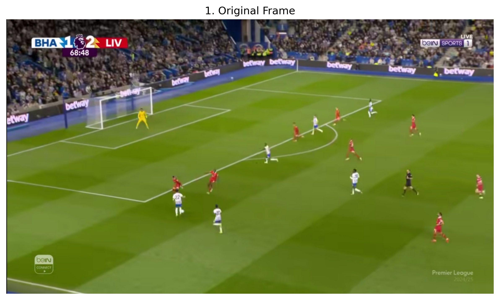
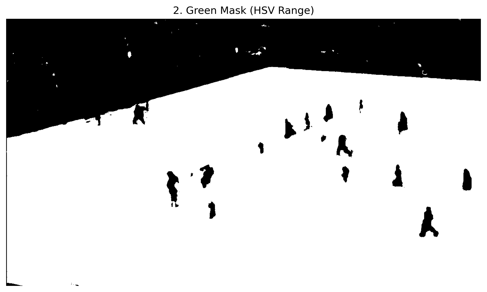
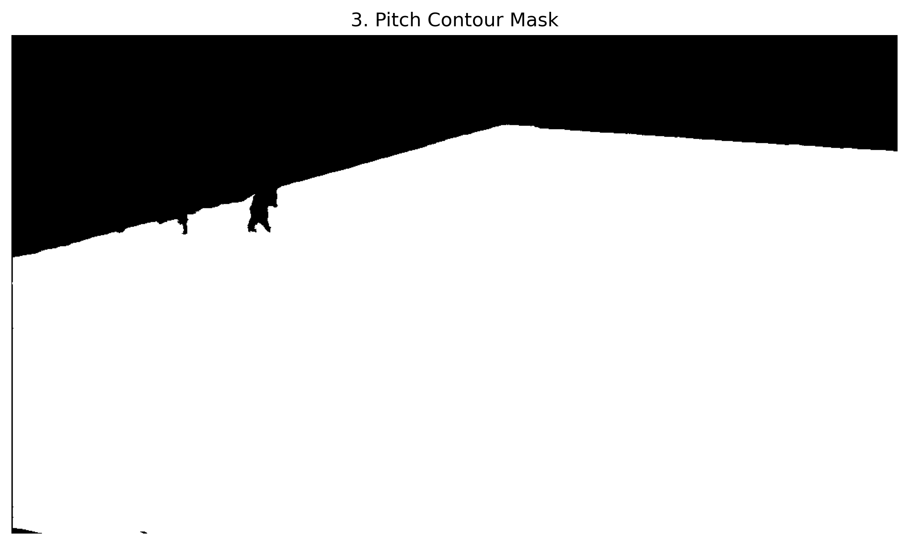
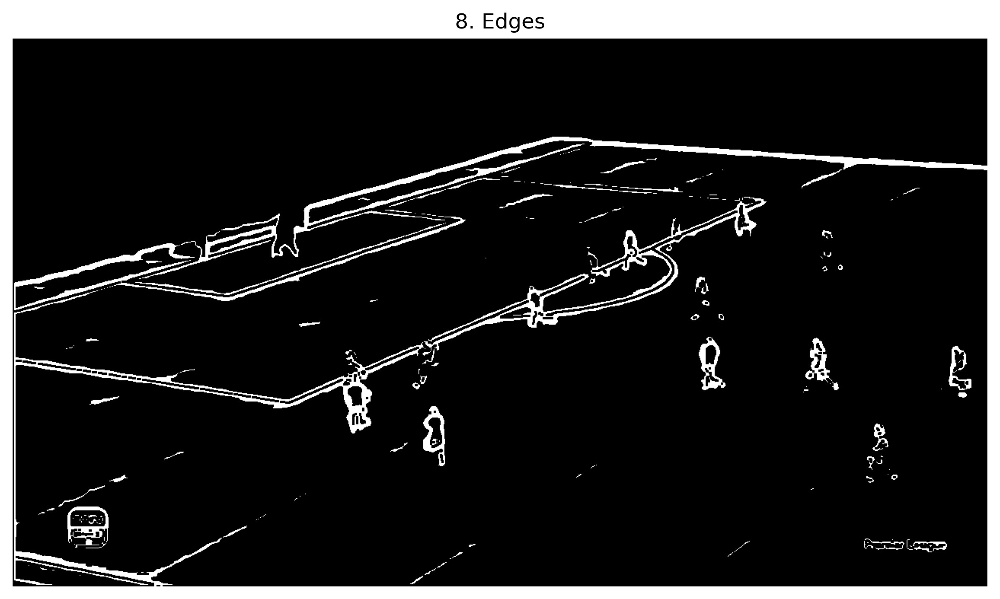
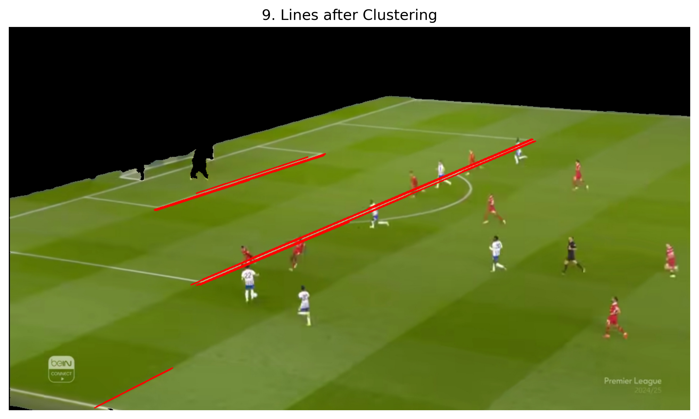
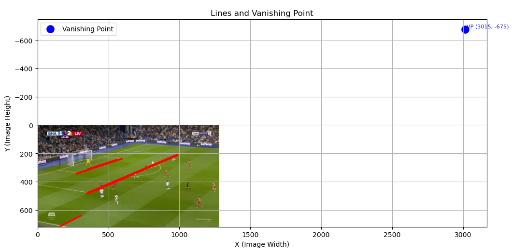
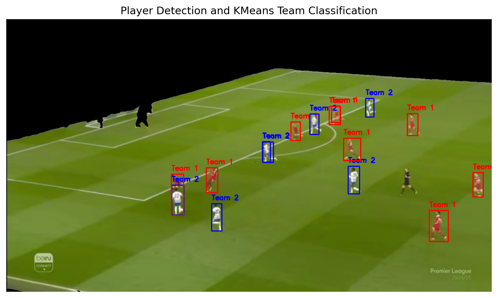
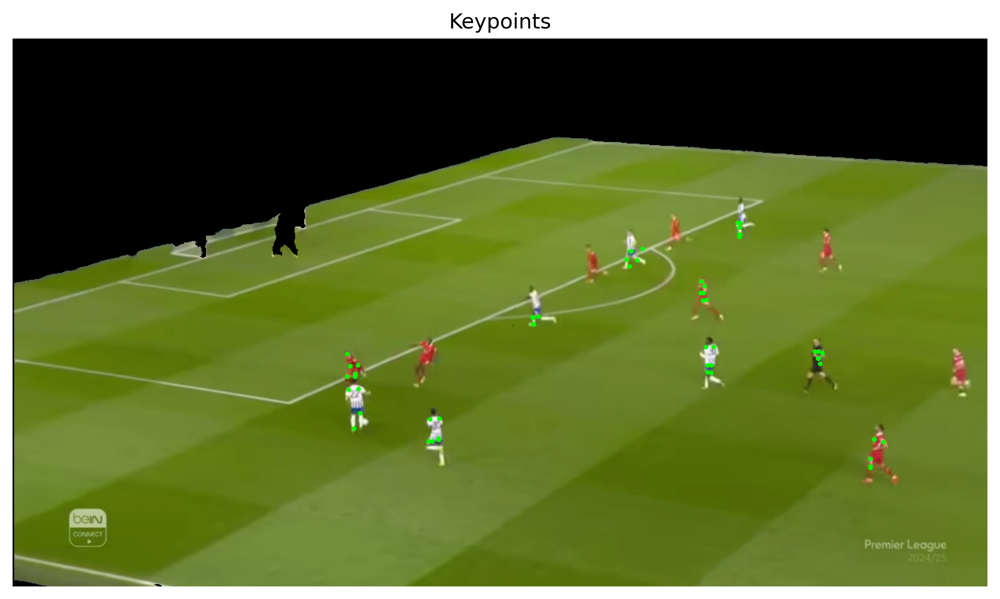
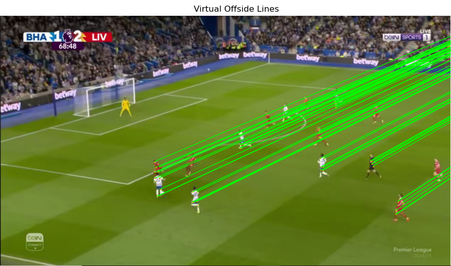

# Offside Detection Pipeline  

## 📌 Overview  
The **Offside Detection Pipeline** is a computer vision system designed to analyze football match frames and automatically detect potential offsides. It leverages state-of-the-art deep learning models for **player detection, pose estimation, pitch segmentation, vanishing point computation, and offside line visualization**.  

The pipeline integrates multiple steps into a single workflow, enabling referees, analysts, and enthusiasts to visualize offsides with higher accuracy.  

---

## 🎯 Objectives  
- Detect football players on the pitch.  
- Classify players into teams based on jersey colors.  
- Extract body keypoints (shoulders, knees, ankles).  
- Estimate vanishing points from pitch lines.  
- Draw virtual offside lines for referee decision support.  

---

## 📸 Pipeline Steps  

### 1. Pitch Segmentation and Edge Extraction  

This stage isolates the football pitch and prepares it for line detection. It consists of several sub-steps:  

#### 1.1 Image Segmentation  
We apply color-based segmentation to extract the pitch region.  
- The input image is read in **BGR format**.  
- Converted to **HSV (Hue, Saturation, Value)** color space, which is more effective in handling variations in lighting.  
- A binary mask is created by defining the range of the most dominant color (**green**).  


  
  

#### 1.2 Contour Extraction  
Contours are extracted from the binary mask to isolate the pitch area.  
- `cv2.findContours` is applied to retrieve the **outermost contours**.  
- Each contour contains the boundary coordinates of the shape.  

  

#### 1.3 Segmenting the Image  
The largest contour (assumed to be the pitch) is selected and drawn on a blank mask.  
- Using a **bitwise AND operation**, we overlay the mask on the original image.  
- This isolates the **region of interest (pitch)** while setting the background to black.  

  

#### 1.4 Edge Extraction  
Edges within the segmented pitch are extracted using **Sobel filters**, which highlight the pitch lines needed for vanishing point detection.  

  
  

---

### 2. Vanishing Point Estimation  
Estimate vanishing points from clustered pitch lines.  
  

### 3. Players per team
Detect football players using **YOLOv8**. and we Classified detected players into teams using **KMeans** or **GMM** clustering.  
  

### 4. Pose Estimation  
Extract player keypoints (shoulders, knees, ankles) using **Keypoint R-CNN**.  
  

### 5. Offside Line Visualization  
Draw virtual offside lines toward the vanishing point.  
  

---

## 🧰 Features  
- ✅ **Pitch segmentation** using Sobel edge detection and clustering.  
- ✅ **Player detection** with **YOLOv8**.  
- ✅ **Pose estimation** using **Keypoint R-CNN**.  
- ✅ **Team classification** with **KMeans** or **GMM**.  
- ✅ **Vanishing point computation** from detected pitch lines.  
- ✅ **Offside line visualization** from selected player keypoints.  

---

## 🛠️ Installation  
Clone the repository and install dependencies:  

```bash
git clone https://github.com/Aliha7ish/offside-detection-pipeline.git
cd offside-detection-pipeline
pip install -r requirements.txt

---

## requirements.txt 
```
pandas
opencv-python
numpy
torch
torchvision
matplotlib
ultralytics
scikit-learn
pclines
scikit-image
shapely
```

---

## 🚀 How to Run

1. Place your match image in the datasets/images/ folder, e.g., liv.jpg.

2. Run the pipeline steps:

```
image_path = "datasets/images/liv.jpg"

# Segment pitch
original, pitch_only, pitch_mask = segment_pitch_area(image_path)
edges = extract_edges_sobel(pitch_only, pitch_mask)
final_img, final_lines = detect_lines_with_clustering(edges, pitch_only)

# Compute vanishing point
vanishing_point = compute_vanishing_point(final_lines)
plot_lines_and_vp(original, final_lines, vanishing_point)

# Detect players and classify teams
img_with_players, player_boxes = detect_players_yolov8(pitch_only)
classified_img, team_labels, filtered_boxes = classify_players_kmeans(img_with_players, player_boxes)

# Extract pose keypoints
keypoints, pose_output = extract_keypoints_for_detected_players(img_with_players, filtered_boxes)

# Draw offside lines
draw_offside_lines(pose_output, keypoints, vanishing_point)
```

---

## 📂 Project Structure
```
offside-detection-pipeline/
│── datasets/
│   └── images/          # Input match images
│── requirements.txt     # Dependencies
│── Virtual_Offside_detection.ipynb  # Main notebook pipeline
└── README.md            # Project documentation
```

---

## 📌 Future Work

- Integration with live video feeds instead of single frames.

- Improved team classification using deep learning jersey recognition.

- Incorporation of multi-camera calibration for real match accuracy.

---
